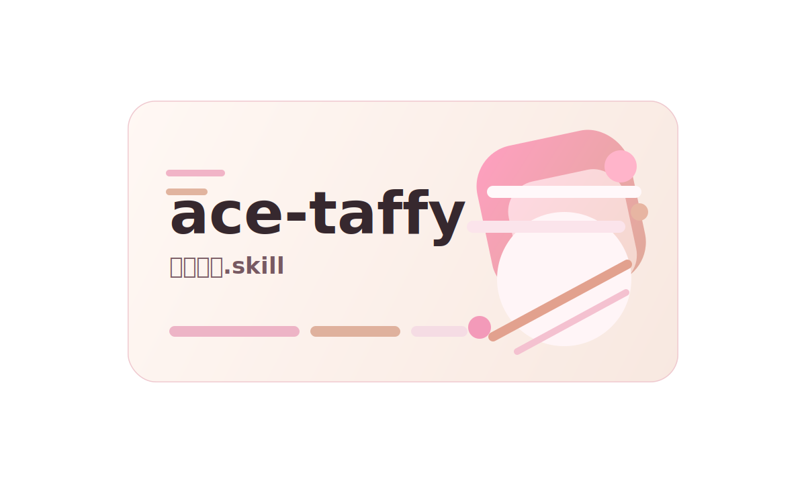
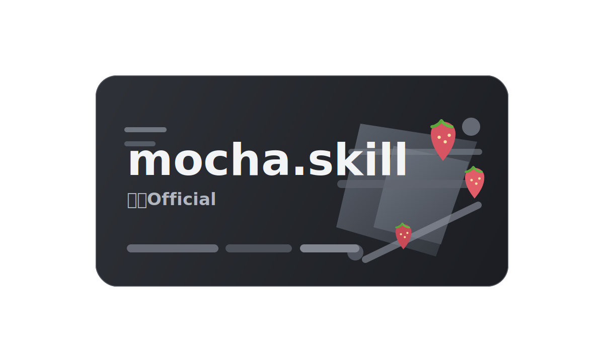

<div align="center">

# vtb.skill · 虚拟主播.skill

> 从微博、Bilibili 等公开来源蒸馏虚拟主播人格，V圈逐渐式微的当下留住你珍爱的美好

[](LICENSE)
[](https://python.org)
[](#安装)
[](#安装)

[数据来源](#支持的数据来源) · [安装](#安装) · [使用](#使用) · [内置示例](#内置示例) · [项目结构](#项目结构)

[**English**](README_EN.md)

<div align="center" style="margin-top: -20px; margin-bottom: -20px;">
  <table align="center" style="border-collapse: collapse; display: table; border: none; margin: 0 auto; padding: 0; border-spacing: 0;">
    <tr style="border: none; margin: 0; padding: 0;">
      <td style="border: none; padding: 0; margin: 0; line-height: 0;">
        <a href="https://github.com/ly-xxx/ace-taffy-skill">
          
        </a>
      </td>
      <td style="border: none; padding: 0; margin: 0; line-height: 0;">
        <a href="https://github.com/ly-xxx/mocha.skill">
          
        </a>
      </td>
    </tr>
  </table>
</div>

</div>

`vtb.skill` 不是 AI 主播引擎，也不做 Live2D、TTS 驱动或直播控场。

它把“蒸馏一个 VTuber.skill”这件事里真正麻烦、但又适合流程化的部分串了起来：

- 把公开可复核的人物材料整理成一个可安装的角色 `.skill`
- 用统一目录和脚本把采集、转写、审计、语料整理串成流水线
- 让不同虚拟主播的蒸馏 repo 能复用同一套框架，而不是每次从零开始拼
- 蒸馏时区分“核心稳定轴”和“可选 recurring motif”，避免把单一梗词蒸成整个人设

当前默认围绕中文互联网公开源构建，优先支持这些链路：

- 微博公开主页 / 公开内容
- Bilibili 主页 / 投稿 / 空间动态 / 直播间简介 / 搜索命中 / 公开视频
- 公开视频音频转写，输出 `json + srt + vtt + tsv + txt`
- 长时间抓取时分阶段落盘，并写入 `_collector_state.json` 以便恢复

## 你最后能拿到什么

如果你用这套框架去做一个新的 VTuber.skill，最终交付通常会包含：

- 一个能安装到 Codex / Claude Code 的角色 skill
- 一套清晰的人格骨架文件：
  `SKILL.md`、`persona.md`、`references/profile.md`、`distillation.md`、`expression-dna.md`、`boundaries.md`、`sources.md`
- 一份可继续维护的 target manifest 和采集配置
- 一套公开源采集、STT、审计、style bank 的可重跑流程
- 一份面向使用者的 README、安装方式和真实示例

换句话说，它不是只帮你“写像某个人的话”，而是帮你把公开蒸馏、语料整理、skill 结构和后续维护一起搭出来。

## 这套框架擅长什么

- 自动先查 Bilibili / 微博公开入口，而不是上来先逼用户手填 manifest
- 同时处理主页、动态、直播间、投稿和公开视频转写
- 支持单信源 fallback：只有 Bilibili 也能继续构建，不会直接报废
- 支持长跑采集和断点恢复，适合积累上千条公开文本
- 把风格拆成“稳定骨架”和“可选 motif”，减少蒸馏跑偏
- 输出的视频转写格式默认兼容大多数剪辑和字幕工具

## 一分钟开始

如果你只是想做一个“自己喜欢的 VTB.skill”，先别急着扎进脚本堆里喵。

先把 `create-vtb` 装上，然后直接把这段话贴给 Codex 或 Claude Code：

```text
请使用 create-vtb，帮我做一个新的 vtuber skill，人物是 XXX。
先自己查 Bilibili 和微博公开来源。
如果只找到一个平台，就按单信源继续。
如果两个都找不到，就停下并告诉我原因。
默认直接创建仓库、补 README、补安装方式，并给出几个可运行示例。
```

如果你想指定风格，再补一句就够：

```text
尽量保留：XXX。
不要写成：XXX。
```

如果你想直接做成仓库里的内置示例，再补一句：

```text
请把它做成 vtb.skill/examples/xxx.skill 的内置示例。
```

## 你只需要提供什么

- 最少只要提供角色名，剩下的来源核验、manifest、README、安装指引，默认都由 `create-vtb` 先接过去喵。
- 如果你有偏好，补“想保留什么风格 / 不要碰什么风格”就够了。
- 如果你已经知道官方主页、直播间或微博链接，直接贴出来会更快，但不是前置门槛。

## create-vtb 默认会做什么

- 先核验这个角色有没有稳定的公开 Bilibili / 微博入口。
- 把能确认的来源直接写进 target manifest，缺的来源明确留空。
- 跑公开资料采集，优先拿主页、动态、投稿、直播间信息。
- 选择合适的公开视频做 STT，并输出主流剪辑工具兼容格式。
- 生成可安装的角色 `.skill` 目录、README、安装说明和示例用法。
- 如果证据不足，就明确停下，不会装作已经蒸馏成功了喵。

## 支持的数据来源

| 来源 | 采集内容 | 当前状态 | 备注 |
|------|------|------|------|
| 微博公开页 | 主页简介、公开博文、转发文案 | 可用 | 受访客墙影响较大，建议保守使用 |
| Bilibili 主页 | 简介、认证、标签、投稿列表 | 可用 | 主力来源 |
| Bilibili 空间动态 | 公开动态正文 | 可用 | 走 `opus/feed/space`，支持恢复落盘 |
| Bilibili 直播间 | 房间简介、公告、直播标题 | 可用 | 对人格设定很有价值 |
| Bilibili 公共搜索 | 公开视频种子发现 | 可用 | 用于补齐公开视频列表 |
| Bilibili 视频页 | 标题、简介、分 P、公开播放地址 | 可用 | 支持媒体下载 |
| 视频音频转写 | 公开视频音轨 | 可用 | 基于 `faster-whisper` |

## 长跑采集与恢复

- `collect_bilibili_public.py` 会分阶段写出 `profile/search/video_details/dynamics/live/playurls` 等结果。
- 采集中断后，重新执行同一条命令并保留 `--resume` 即可继续利用已落盘结果。
- 每轮 Bilibili 采集都会写 `sources/raw/bilibili/_collector_state.json`，能直接看见当前停在哪一步、已经拿到多少条。
- 新建目标模板现在默认朝“千级文本积累”配置，微博和 B 站动态上限已经明显提高。

## 安装

### 最快安装

如果你主要是想“先能用起来”，最短就是这一套喵：

```bash
git clone https://github.com/ly-xxx/vtb.skill ~/work/vtb.skill
mkdir -p ~/.codex/skills ~/.claude/skills
ln -snf ~/work/vtb.skill ~/.codex/skills/create-vtb
ln -snf ~/work/vtb.skill ~/.claude/skills/create-vtb
```

如果你只用 Codex 或只用 Claude Code，保留对应那一行软链接就行。

### 安装前提

```bash
pip3 install -r requirements.txt
```

还需要本机可用：

- `ffmpeg`
- Python 3.9+
- `git`
- 访问公开网页所需的网络环境

### 先区分 4 个安装目标

- `create-vtb`：框架 skill，用来新建或维护别的 VTuber skill
- `ace-taffy`：内置塔菲角色示例
- `aza`：内置 Aza 角色示例
- `mocha`：内置单信源角色示例

### Codex

#### 1. 安装框架 `create-vtb`

GitHub 安装：

```bash
mkdir -p ~/.codex/skills
git clone https://github.com/ly-xxx/vtb.skill ~/.codex/skills/create-vtb
```

如果你已经把仓库克隆到本机，开发时更推荐软链接，省得来回挪喵：

```bash
git clone https://github.com/ly-xxx/vtb.skill ~/work/vtb.skill
mkdir -p ~/.codex/skills
ln -snf ~/work/vtb.skill ~/.codex/skills/create-vtb
```

#### 2. 安装内置角色示例

因为 `ace-taffy` 和 `aza` 是仓库里的子目录，推荐先把整个仓库克隆到本机，再链接具体示例：

```bash
git clone https://github.com/ly-xxx/vtb.skill ~/work/vtb.skill
mkdir -p ~/.codex/skills
ln -snf ~/work/vtb.skill/examples/taffy.skill ~/.codex/skills/ace-taffy
ln -snf ~/work/vtb.skill/examples/aza.skill ~/.codex/skills/aza
ln -snf ~/work/vtb.skill/examples/mocha.skill ~/.codex/skills/mocha
```

如果你当前就在仓库根目录，也可以直接：

```bash
mkdir -p ~/.codex/skills
ln -snf "$(pwd)" ~/.codex/skills/create-vtb
ln -snf "$(pwd)/examples/taffy.skill" ~/.codex/skills/ace-taffy
ln -snf "$(pwd)/examples/aza.skill" ~/.codex/skills/aza
ln -snf "$(pwd)/examples/mocha.skill" ~/.codex/skills/mocha
```

#### 3. 验证 Codex 已加载

新开一个 Codex 会话，然后直接点名 skill 就行喵：

```text
请使用 create-vtb skill，告诉我如何为一个新 VUP 创建 target manifest。
```

```text
请使用 ace-taffy skill，只输出一条对粉丝评论“今天怎么这么晚才来”的回复。
```

```text
请使用 aza skill，只输出一条今晚八点开播的直播间预告。
```

```text
请使用 mocha skill，只输出一条游戏直播间短标题。
```

### Claude Code

Claude Code 常见两种安装位置：

- 全局：`~/.claude/skills/`
- 项目内：`.claude/skills/`

#### 1. 全局安装框架 `create-vtb`

```bash
mkdir -p ~/.claude/skills
git clone https://github.com/ly-xxx/vtb.skill ~/.claude/skills/create-vtb
```

如果你想边改边用，同样推荐软链接：

```bash
git clone https://github.com/ly-xxx/vtb.skill ~/work/vtb.skill
mkdir -p ~/.claude/skills
ln -snf ~/work/vtb.skill ~/.claude/skills/create-vtb
```

#### 2. 项目内安装框架 `create-vtb`

在目标项目根目录执行：

```bash
mkdir -p .claude/skills
git clone https://github.com/ly-xxx/vtb.skill .claude/skills/create-vtb
```

或者用本地仓库软链接：

```bash
mkdir -p .claude/skills
ln -snf ~/work/vtb.skill .claude/skills/create-vtb
```

#### 3. 安装内置角色示例

全局安装：

```bash
git clone https://github.com/ly-xxx/vtb.skill ~/work/vtb.skill
mkdir -p ~/.claude/skills
ln -snf ~/work/vtb.skill/examples/taffy.skill ~/.claude/skills/ace-taffy
ln -snf ~/work/vtb.skill/examples/aza.skill ~/.claude/skills/aza
ln -snf ~/work/vtb.skill/examples/mocha.skill ~/.claude/skills/mocha
```

项目内安装：

```bash
git clone https://github.com/ly-xxx/vtb.skill ~/work/vtb.skill
mkdir -p .claude/skills
ln -snf ~/work/vtb.skill/examples/taffy.skill .claude/skills/ace-taffy
ln -snf ~/work/vtb.skill/examples/aza.skill .claude/skills/aza
ln -snf ~/work/vtb.skill/examples/mocha.skill .claude/skills/mocha
```

#### 4. 验证 Claude Code 已加载

在 Claude Code 里直接调用：

```text
/create-vtb
```

```text
/ace-taffy 写一条今晚开播的预告，像公开营业语境
```

```text
/aza 写一条粉丝互动回复，语气要像阿萨公开场合会说的话
```

```text
/mocha 写一条简短的游戏向互动回复
```

### 更新与删除

如果你是直接 `git clone` 安装的：

```bash
git -C ~/.codex/skills/create-vtb pull --ff-only
git -C ~/.claude/skills/create-vtb pull --ff-only
```

如果你用的是软链接，更新工作区仓库就够了。

删除时直接移除对应 skill 目录或软链接：

```bash
rm -rf ~/.codex/skills/create-vtb ~/.codex/skills/ace-taffy ~/.codex/skills/aza ~/.codex/skills/mocha
rm -rf ~/.claude/skills/create-vtb ~/.claude/skills/ace-taffy ~/.claude/skills/aza ~/.claude/skills/mocha
```

## 使用

### 先用聊天创建，而不是先手工填表

这套框架最适合聊天起手，不建议上来先把自己埋进 manifest 里喵。推荐你直接在 Codex 或 Claude Code 里这样说：

```text
请使用 create-vtb，帮我创建一个新的 vtuber skill，人物是 XXX。
先自己查 Bilibili 和微博公开来源。
找不到的来源留空并告诉我。
如果两个都找不到，就不要继续构建。
最后把仓库结构、安装方式和示例一起补全。
```

如果你只想做框架内示例，可以把最后一句换成：

```text
请把它做成 vtb.skill/examples/xxx.skill 的内置示例。
```

### 直接复制的常用话术

下面这些都能直接复制，按需求挑一条就能开工喵。

只知道名字时：

```text
请使用 create-vtb，帮我为 XXX 创建一个新的 vtuber skill。
你先自己查公开来源并开始构建。
缺失来源请明确告诉我，不要让我先手填 manifest。
```

想控制风格时：

```text
请使用 create-vtb，帮我为 XXX 创建一个新的 vtuber skill。
尽量保留：直播口头禅、开播节奏、公开营业感。
不要写成：纯卖萌模板、语录复读器、只会堆口癖的人设。
你先自己查公开来源，再继续。
```

已经有链接时：

```text
请使用 create-vtb，帮我为 XXX 创建一个新的 vtuber skill。
这里是我已经确认的公开入口：
- Bilibili：XXX
- 微博：XXX
请在这些来源基础上继续补全 repo、README 和安装说明。
```

想做独立仓库而不是内置示例时：

```text
请使用 create-vtb，帮我为 XXX 创建一个独立 repo，名字叫 xxx.skill。
先自己查公开来源，再把可安装的 skill、README、中英文安装说明和示例一起补齐。
```

### 缺失来源时怎么处理

这一段很重要，别硬冲喵：

- 找到 Bilibili，没找到微博：继续做，按单信源构建
- 找到微博，没找到 Bilibili：继续做，但不能走视频/STT 主链路
- 两边都找不到稳定官方入口：停止构建，并把阻断原因直接告诉用户

### 如果你还是想手工跑命令

如果你就是想手搓全流程，也可以按这个顺序来喵：

1. 复制模板 manifest：

```bash
cp templates/target.template.json examples/new-vtuber.skill/sources/targets/example.json
```

2. 补齐平台信息与风格提示：

- `slug`
- `display_name`
- `canonical_sources`
- `collection_defaults`
- `style_hints`

3. 采集公开资料：

```bash
cd examples/new-vtuber.skill
python3 ../../tools/source_refresh_public.py --target sources/targets/example.json
```

4. 选择公开视频做 STT：

```bash
python3 ../../tools/batch_bilibili_stt.py \
  --target sources/targets/example.json \
  --include-title "自我介绍|直播|杂谈|问答" \
  --limit 3 \
  --model small
```

5. 审计并导出可复用语料：

```bash
python3 ../../tools/audit_transcripts.py \
  --input-dir sources/transcripts \
  --video-details sources/raw/bilibili/video_details.json \
  --output-json sources/processed/transcript-audit.json \
  --output-tsv sources/processed/transcript-audit.tsv

python3 ../../tools/build_training_set.py --audit-json sources/processed/transcript-audit.json
python3 ../../tools/build_style_bank.py --target sources/targets/example.json
```

6. 写角色 skill：

- `SKILL.md`
- `persona.md`
- `references/profile.md`
- `references/distillation.md`
- `references/expression-dna.md`
- `references/boundaries.md`
- `references/sources.md`

### 设计原则

- 只蒸馏公开、可复核、稳定的人格特征
- 最新动态、精确原话、争议信息默认不编造
- 角色感优先来自节奏、互动方式、叙事结构，而不是堆叠口癖
- 下载与转写产物尽量输出通用格式，兼容常见视频制作工具
- 新用户入口优先是“复制一句话给 Codex / Claude Code”，不是先读一堆脚本说明

## 内置示例

仓库现在内置三个可安装角色示例，都能真的装、真的看、真的拿来对照改喵：

- [examples/taffy.skill](examples/taffy.skill)：塔菲的内置成熟示例，既能安装，也能在框架里真实刷新数据
- [examples/aza.skill](examples/aza.skill)：Aza 的框架内原生示例，偏“从公开源一路跑到 STT 与 style bank”
- [examples/mocha.skill](examples/mocha.skill)：单信源示例，验证“只有 Bilibili、没有微博时也能构建”

### Taffy 示例

主要入口文件：

- [examples/taffy.skill/SKILL.md](examples/taffy.skill/SKILL.md)
- [examples/taffy.skill/persona.md](examples/taffy.skill/persona.md)
- [examples/taffy.skill/references/profile.md](examples/taffy.skill/references/profile.md)
- [examples/taffy.skill/references/meow-pattern.md](examples/taffy.skill/references/meow-pattern.md)
- [examples/taffy.skill/references/self-reference.md](examples/taffy.skill/references/self-reference.md)
- [examples/taffy.skill/sources/targets/ace-taffy.json](examples/taffy.skill/sources/targets/ace-taffy.json)

这个示例更适合拿来抄结构：

- 角色约束如何写到很细
- 口癖规则如何结构化落地
- 一个成熟角色 skill 的文件组织方式

下面这些不是空口说白话，都是实际跑过的结果：

- 外部 `taffy.skill` 实际补齐了 `149` 条 Bilibili 空间动态
- `examples/taffy.skill` 实际采集了 `180` 条 Bilibili 视频元数据和 `149` 条空间动态
- `build_corpus_public.py` 为 `examples/taffy.skill` 生成了 `330` 条公开 source records
- 采集过程中会持续写入 `sources/raw/bilibili/_collector_state.json`，中断后可续跑

### Aza 示例

主要入口文件：

- [examples/aza.skill/SKILL.md](examples/aza.skill/SKILL.md)
- [examples/aza.skill/persona.md](examples/aza.skill/persona.md)
- [examples/aza.skill/references/profile.md](examples/aza.skill/references/profile.md)
- [examples/aza.skill/references/distillation.md](examples/aza.skill/references/distillation.md)
- [examples/aza.skill/references/style-bank.md](examples/aza.skill/references/style-bank.md)
- [examples/aza.skill/sources/targets/aza.json](examples/aza.skill/sources/targets/aza.json)

下面这些也是实际跑过的结果：

- `collect_weibo_public.py` 实际采集了 `120` 条微博公开博文
- `collect_bilibili_public.py` 实际采集了 `120` 条 Bilibili 视频元数据和 `30` 条空间动态
- `build_corpus_public.py` 生成了 `279` 条公开 source records，合并 STT 后总 corpus 为 `412` 条
- `batch_bilibili_stt.py` 实际转写了 `2` 条 Bilibili 视频
- 输出了 `json / srt / vtt / tsv / txt` 五种通用格式
- `audit_transcripts.py` 判定 `2 / 2` 样本均为 `high`
- `build_training_set.py` 导出了 `110` 条 `high-only` 训练片段
- `build_style_bank.py` 基于 `transcript_train_high.jsonl` 抽出了 Aza 的口播片段
- 示例规则已经额外约束：`打工 / 房租 / 好哥哥` 只作可选 motif，不再作为默认输出骨架

### Aza Smoke Test

下面是按照当前 `aza.skill` 规则实际打出来的两条示范输出：

**输入**：`写一个今晚八点开播文案`

**输出**：

```text
朋友们，今晚八点见。
最近攒了点想唱的，也想顺手玩点有意思的，开播再跟你们慢慢聊。
想来的就来，别迟到。
```

**输入**：`粉丝问：今天又在打工吗？`

**输出**：

```text
也算在忙，不过今天这趟不算无聊。
有歌想唱，有东西想玩，顺便来跟你们报个到。
```

### Mocha 示例

这个示例专门验证缺省来源规则，适合拿来看“来源不全时怎么稳住”：

- 已确认 Bilibili：`mid=212535360`
- 已确认直播间：`room_id=21849412`
- 未检到稳定官方微博主页，因此 manifest 中微博留空
- `source_refresh_public.py` 会对微博缺失打印明确 `WARN`，然后继续用 Bilibili 构建

适合参考：

- 单信源 manifest 怎么写
- 缺微博时如何明确提示而不是静默跳过
- 资料较少时如何保守蒸馏，不乱补设定

本轮已经实际跑过的结果：

- `collect_bilibili_public.py` 实际采集了 `6` 条 Bilibili 视频元数据和 `42` 条空间动态
- `build_corpus_public.py` 生成了 `49` 条公开 source records，合并现有转写后总 corpus 为 `79` 条
- `batch_bilibili_stt.py` 实际转写了 `2` 条 Bilibili 视频
- 输出了 `json / srt / vtt / tsv / txt` 五种通用格式
- `audit_transcripts.py` 当前把 `2 / 2` 样本判为 `medium`
- `build_style_bank.py` 基于 `transcript_train_ready.jsonl` 抽出了第一版口播片段
- 这一版还额外把 `草莓 / 病床 / 饺子` 固化成高权重生活锚点，避免被蒸成轻飘飘的萌点

主要入口文件：

- [examples/mocha.skill/SKILL.md](examples/mocha.skill/SKILL.md)
- [examples/mocha.skill/persona.md](examples/mocha.skill/persona.md)
- [examples/mocha.skill/references/profile.md](examples/mocha.skill/references/profile.md)
- [examples/mocha.skill/references/distillation.md](examples/mocha.skill/references/distillation.md)
- [examples/mocha.skill/references/style-bank.md](examples/mocha.skill/references/style-bank.md)
- [examples/mocha.skill/sources/targets/mocha.json](examples/mocha.skill/sources/targets/mocha.json)

## 项目结构

```text
vtb.skill/
├── SKILL.md
├── README.md
├── README_EN.md
├── docs/
├── prompts/
├── references/
├── templates/
├── tools/
└── examples/
    ├── aza.skill/
    ├── mocha.skill/
    └── taffy.skill/
```

其中：

- 根目录 `SKILL.md` 是 `create-vtb` 框架技能入口
- `tools/` 是公开源采集、下载、STT、审计和语料整理脚本
- `templates/` 是 manifest 模板
- `examples/aza.skill/` 是框架内原生示例
- `examples/mocha.skill/` 是 bilibili-only 单信源示例
- `examples/taffy.skill/` 是成熟角色 skill 的内置快照
- 发布版示例目录默认只保留轻量摘要，不把本地下载媒体、完整原始抓取和训练 JSONL 一起带走

## 非目标

以下内容不在当前仓库范围内：

- AI 直播控制台
- Live2D / avatar 驱动
- 实时语音合成
- 中之人推断、私生活考据、未证实八卦

## 许可证

MIT
